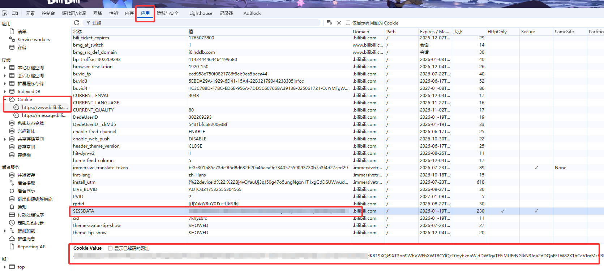

# B站视频解析插件

适用于 MaiBot 的 B站视频内容解析插件。

---

## ⚠️ 免责声明

**本插件使用 Claude 4.5 全面编写。**

使用本插件即表示您同意以下条款：

1. 本插件按"原样"提供，不提供任何形式的明示或暗示担保
2. 作者不对因使用本插件而导致的任何直接、间接、偶然、特殊或后果性损害承担责任
3. 本插件仅供学习和研究目的，请遵守相关法律法规和B站用户协议
4. 用户应自行承担使用本插件的全部风险

---

## ⚠️ 注意事项

在使用本插件前，请**务必注意**以下几点：

1. **必须安装插件依赖**：本插件需要额外的 Python 依赖包，请参考下方"安装插件"章节。
2. **ASR功能配置**：如需使用 ASR 功能（语音转文字），必须在 MaiBot 配置文件 `model_config.toml` 中配置 `[model_task_config.voice]` 语音识别模型，否则 ASR 功能无法正常运行。
3. **FFmpeg 功能说明**：FFmpeg 是本插件的核心依赖，负责以下功能：
   - 视频下载后的格式处理
   - 视频抽帧（提取关键帧用于视觉分析）
   - 音频分离（用于 ASR 语音识别）
4. **SESSDATA** ：使用此功能获取视频字幕，可能会导致账号被**b站风控**，请使用小号。

---

## 安装前准备

### 安装 ffmpeg

- 本插件需要系统安装 **ffmpeg** 工具。插件会自动检测系统 PATH 中的 ffmpeg。


---

## 安装插件

1. 将整个 `bilibili_video_parser` 目录复制到 MaiBot 的 `plugins` 目录下

2. **安装插件依赖**（必须在 MaiBot 的虚拟环境中执行）：

   ```bash
   #### 首先进入 MaiBot 的虚拟环境
   # Windows:
   cd MaiBot目录
   .venv\Scripts\activate
   
   # Linux/macOS:
   cd MaiBot目录
   source .venv/bin/activate
   
   # 然后安装插件依赖
   pip install -r plugins/bilibili_video_parser/requirements.txt
   ```

3. 确保系统已安装 ffmpeg

4. 重启 MaiBot 或在 WebUI 中重新加载插件，使插件自动生成配置文件

5. 修改完插件配置文件请再次重启maibot。

---

## 使用方法

### 自动检测模式

直接发送 B站视频链接、AV号或BV号，麦麦会自动识别并解析：

```
https://www.bilibili.com/video/BV1xx411c7XZ
https://b23.tv/xxxxxx
av12345678
BV1xx411c7XZ
```

### 命令模式

使用 `/bili` 命令主动触发解析：

```
/bili https://www.bilibili.com/video/BV1xx411c7XZ
/bili av12345678
/bili BV1xx411c7XZ
```

---

## 配置文件说明

配置文件位于插件目录下的 `config.toml`，首次启动会自动生成。

### [plugin] 插件基本信息

| 配置项 | 类型 | 默认值 | 说明 |
|--------|------|--------|------|
| `config_version` | string | `"3.0.0"` | 配置文件版本号，请勿手动修改 |
| `enabled` | bool | `true` | 是否启用插件 |

### [trigger] 触发方式配置

| 配置项 | 类型 | 默认值 | 说明 |
|--------|------|--------|------|
| `auto_detect_enabled` | bool | `true` | 是否自动检测B站链接。开启后，用户发送B站链接时会自动触发解析 |
| `command_enabled` | bool | `true` | 是否启用 `/bili` 命令触发 |

### [video] 全局视频配置

| 配置项 | 类型 | 默认值 | 说明 |
|--------|------|--------|------|
| `max_duration_min` | float | `30.0` | 视频最大时长（分钟）。超过此时长的视频将被跳过不处理。例如设置为30，则30分59秒的视频仍可处理，31分钟的视频会被跳过 |
| `max_size_mb` | int | `200` | 视频最大文件大小（MB）。超过此大小的视频将被跳过 |
| `enable_asr` | bool | `false` | 是否启用ASR语音识别。开启后会从视频音轨中提取语音进行识别，作为字幕的补充。需要MaiBot配置voice模型 |
| `sessdata` | string | `""` | B站SESSDATA Cookie。用于获取视频字幕，不填写时将跳过字幕获取。获取方法见下文。<br />**使用此功能获取视频字幕，可能会导致账号被b站风控，请使用小号。** |
| `temp_file_max_age_min` | int | `60` | 临时文件最大保留时间（分钟）。设为0表示处理完成后立即删除；设为>0表示定时清理超过指定时间的临时文件 |
| `retry_max_attempts` | int | `3` | 网络请求最大重试次数（针对可重试的错误如网络超时、服务器错误等） |
| `retry_interval_sec` | float | `2.0` | 网络请求重试间隔（秒） |

**如何获取 SESSDATA：**使用此功能获取视频字幕，可能会导致账号被b站风控，请使用小号。

1. 登录 B站网页版
2. 按 F12 打开开发者工具
3. 切换到"应用程序"（Application）标签
4. 在左侧找到 Cookies → bilibili.com
5. 找到名为 `SESSDATA` 的 Cookie，复制其值


### [analysis] 视觉分析配置

| 配置项 | 类型 | 默认值 | 说明 |
|--------|------|--------|------|
| `visual_method` | string | `"default"` | 视觉分析方式，可选值见下表 |
| `enable_summary` | bool | `true` | 是否生成最终总结（仅影响自动检测模式）。开启时会调用主回复模型生成80-120字的总结；关闭时直接将原生视频信息发送给主回复系统 |

**visual_method 可选值：**

| 值 | 说明 |
|----|------|
| `default` | 使用 MaiBot 主程序配置的 VLM 模型进行帧分析（推荐） |
| `builtin` | 使用插件内置的 VLM 配置，需要在 `[analysis.builtin]` 中配置 API |
| `doubao` | 使用豆包视频理解模型，需要在 `[analysis.doubao]` 中配置 API |
| `none` | 不进行视觉分析，仅使用字幕和视频信息 |

### [analysis.default] Default模式配置

使用 MaiBot 主程序的 VLM 模型时的配置。

| 配置项 | 类型 | 默认值 | 说明 |
|--------|------|--------|------|
| `visual_max_duration_min` | float | `10.0` | 进行视觉分析的最大视频时长（分钟）。超过此时长的视频将只使用字幕+ASR，不进行视觉分析（节省API费用） |
| `max_frames` | int | `10` | 最大分析帧数。视频会被等距抽取这么多帧进行分析 |
| `frame_interval_sec` | int | `6` | 抽帧间隔（秒）。每隔多少秒抽取一帧，实际帧数受 max_frames 限制 |

### [analysis.builtin] Builtin模式配置

使用插件内置 VLM 时的配置。需要自行配置 API。

| 配置项 | 类型 | 默认值 | 说明 |
|--------|------|--------|------|
| `visual_max_duration_min` | float | `10.0` | 进行视觉分析的最大视频时长（分钟） |
| `max_frames` | int | `10` | 最大分析帧数 |
| `frame_interval_sec` | int | `6` | 抽帧间隔（秒） |
| `client_type` | string | `"openai"` | API服务类型：`openai`（兼容OpenAI格式的API）或 `gemini`（Google Gemini格式） |
| `base_url` | string | `"https://api.siliconflow.cn/v1"` | API基础URL |
| `api_key` | string | `""` | API密钥 |
| `model` | string | `"Qwen/Qwen2.5-VL-72B-Instruct"` | 模型标识符（API服务商提供的模型ID） |
| `temperature` | float | `0.3` | 模型温度（0-1），值越低输出越确定 |
| `max_tokens` | int | `512` | 最大输出token数 |
| `timeout` | int | `60` | 请求超时时间（秒） |
| `max_retries` | int | `2` | 最大重试次数 |
| `retry_interval` | int | `5` | 重试间隔时间（秒） |
| `frame_prompt` | string | `""` | 自定义帧分析提示词，留空使用默认提示词 |

### [analysis.doubao] Doubao模式配置

使用豆包视频理解模型时的配置。

| 配置项 | 类型 | 默认值 | 说明 |
|--------|------|--------|------|
| `visual_max_duration_min` | float | `10.0` | 进行视觉分析的最大视频时长（分钟） |
| `api_key` | string | `""` | 豆包API密钥，也可通过环境变量 `ARK_API_KEY` 设置 |
| `model_id` | string | `"doubao-seed-1-6-251015"` | 豆包模型ID |
| `fps` | float | `1.0` | 抽帧频率（0.2-5），值越高理解越精细但token消耗越大 |
| `base_url` | string | `"https://ark.cn-beijing.volces.com/api/v3"` | 豆包API基础URL |
| `timeout` | int | `120` | 请求超时时间（秒） |
| `max_retries` | int | `2` | 最大重试次数 |
| `retry_interval` | int | `10` | 重试间隔时间（秒） |
| `video_prompt` | string | `""` | 自定义视频分析提示词，留空使用默认提示词 |

### [cache] 缓存配置

| 配置项 | 类型 | 默认值 | 说明 |
|--------|------|--------|------|
| `enabled` | bool | `true` | 是否启用缓存。开启后，已解析的视频总结会被缓存，避免重复处理 |

---

## 配置示例

### 最简配置（使用MaiBot的VLM）

```toml
[plugin]
enabled = true

[trigger]
auto_detect_enabled = true
command_enabled = true

[video]
sessdata = "你的SESSDATA"

[analysis]
visual_method = "default"
```

### 使用插件内置VLM（硅基流动）

```toml
[plugin]
enabled = true

[video]
sessdata = "你的SESSDATA"

[analysis]
visual_method = "builtin"

[analysis.builtin]
client_type = "openai"
base_url = "https://api.siliconflow.cn/v1"
api_key = "你的API密钥"
model = "Qwen/Qwen2.5-VL-72B-Instruct"
```

### 使用豆包视频模型

```toml
[plugin]
enabled = true

[video]
sessdata = "你的SESSDATA"

[analysis]
visual_method = "doubao"

[analysis.doubao]
api_key = "你的豆包API密钥"
model_id = "doubao-seed-1-6-251015"
```

---

## 故障排查

### ffmpeg 未找到

**症状**：插件加载时提示 "ffmpeg不可用，视频解析功能将受限"

**解决方法**：
1. 在终端运行 `ffmpeg -version` 确认安装成功
2. 如果命令不存在，请按照上述安装方法安装 ffmpeg
3. Windows 用户安装后需要重启终端或电脑
4. 手动安装的用户请确认 bin 目录已添加到 PATH

### 视频下载失败

**可能原因**：
- 视频需要B站登录才能观看（配置 SESSDATA 可解决部分情况）
- 视频有地区限制
- 网络连接问题

### 字幕获取失败

**可能原因**：
- 未配置 SESSDATA
- SESSDATA 已过期（需要重新获取）
- 视频本身没有字幕

### 视觉分析失败

**可能原因**：
- VLM API 配置错误
- API 密钥无效或余额不足
- 网络连接问题

---


---

## 开源协议

本插件采用 **GNU Affero General Public License v3.0 (AGPL-3.0)** 协议开源。

```
Copyright (C) 2024

This program is free software: you can redistribute it and/or modify
it under the terms of the GNU Affero General Public License as published by
the Free Software Foundation, either version 3 of the License, or
(at your option) any later version.

This program is distributed in the hope that it will be useful,
but WITHOUT ANY WARRANTY; without even the implied warranty of
MERCHANTABILITY or FITNESS FOR A PARTICULAR PURPOSE.  See the
GNU Affero General Public License for more details.

You should have received a copy of the GNU Affero General Public License
along with this program.  If not, see <https://www.gnu.org/licenses/>.
```

完整协议文本请参阅 [LICENSE](LICENSE) 文件。